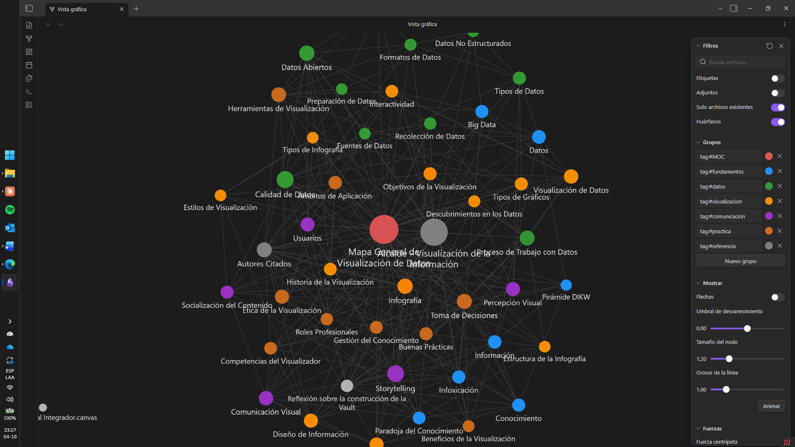
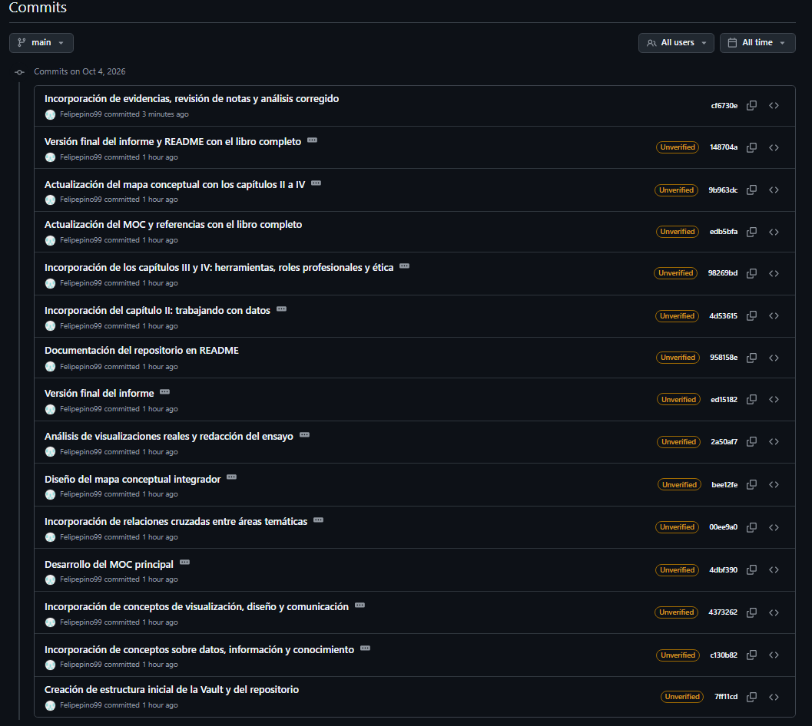

# Visualización de Datos – Unidad 1
### Construcción de una Base de Conocimiento y Análisis Crítico de la Visualización de Datos

## Información General

| | |
|---|---|
| **Estudiante** | Felipe Zapata Lagos |
| **Asignatura** | Visualización de Datos |
| **Carrera** | Ingeniería en Informática – INACAP |
| **Fecha** | Octubre 2026 |
| **Evaluación** | Sumativa Unidad 1 (30 %) |

## Descripción del Proyecto

Base de conocimiento construida en **Obsidian** a partir del libro *Visualización de la información: De los datos al conocimiento* (Ignasi Alcalde), versionada con **GitHub**. El proyecto incluye:

- Una bóveda con un MOC central y **43 notas conceptuales** interconectadas, basadas en los cuatro capítulos del libro (más de 500 enlaces internos, todos bidireccionales y sin nodos aislados).
- Un **mapa conceptual integrador** en Canvas con 1 concepto central, 15 secundarios, 40 terciarios, relaciones etiquetadas y 15 relaciones cruzadas.
- Un **informe** con el análisis crítico de tres visualizaciones reales (INE, Our World in Data, Banco Central de Chile), un ensayo reflexivo y una reflexión sobre gestión del conocimiento digital.

## Estructura del Repositorio

```
visualizacion-datos-u1-zapata-felipe/
├── README.md
├── VisualizacionDatos_Zapata_Felipe/        ← Vault de Obsidian
│   ├── MOC/                                 ← Mapa General de Visualización de Datos
│   ├── Conceptos/                           ← 43 notas conceptuales
│   ├── Referencias/                         ← Libro y autores citados
│   ├── Reflexiones/                         ← Reflexión sobre la construcción de la Vault
│   ├── MapaConceptual/                      ← Mapa Conceptual Integrador.canvas
│   └── .obsidian/                           ← Configuración (grupos de color del grafo)
├── MapaConceptual/                          ← Mapa conceptual en PDF
├── Informe/                                 ← Informe en PDF y Markdown
├── Evidencias/                              ← GraphView.png, HistorialCommits.png, capturas
└── Recursos/                                ← Mapa del cap. 1 y script de generación del informe
```

## Estructura de la Vault

Cada nota conceptual tiene cuatro secciones: **Definición**, **Resumen Personal**, **Importancia** y **Relacionado con**, además de la fuente. Las notas se agrupan con etiquetas en cinco áreas temáticas, que el Graph View muestra con colores distintos:

| Área | Color | Ejemplos |
|---|---|---|
| Fundamentos | Azul | Datos, Información, Conocimiento, Pirámide DIKW, Infoxicación, Big Data |
| Gestión de datos | Verde | Tipos de Datos, Fuentes y Formatos de Datos, Datos Abiertos, Calidad, Preparación |
| Visualización y diseño | Naranjo | Visualización de Información, Infografía, Tipos de Gráficos, Interactividad |
| Comunicación y personas | Morado | Comunicación Visual, Percepción Visual, Storytelling, Usuarios |
| Práctica y aplicación | Café | Buenas Prácticas, Ética, Herramientas, Roles Profesionales, Toma de Decisiones |

**Para abrirla:** Obsidian → *Open folder as vault* → seleccionar `VisualizacionDatos_Zapata_Felipe`.

## Captura del Graph View



## Mapa Conceptual

- Canvas: `VisualizacionDatos_Zapata_Felipe/MapaConceptual/Mapa Conceptual Integrador.canvas`
- PDF: [`MapaConceptual/Mapa_Conceptual_Integrador_Zapata_Felipe.pdf`](MapaConceptual/Mapa_Conceptual_Integrador_Zapata_Felipe.pdf)

## Informe

[`Informe/Informe_U1_Zapata_Felipe.pdf`](Informe/Informe_U1_Zapata_Felipe.pdf): análisis de visualizaciones reales, ensayo profesional y reflexión sobre gestión del conocimiento.

## Historial de Commits



## Aprendizajes Obtenidos

- La visualización no es decoración: es el puente que lleva **de los datos al conocimiento** y de ahí a la toma de decisiones.
- Lo más valioso de construir la bóveda fue decidir cómo se relacionan los conceptos. Enlazar obliga a entender.
- Al analizar gráficos reales comprobé que ninguna visualización es neutral: el período, el indicador y la forma de mostrar (o no mostrar) la incertidumbre orientan la lectura.
- Git y GitHub dan trazabilidad al aprendizaje. Como mejora personal, en el próximo proyecto haré commits pequeños desde el primer día.
